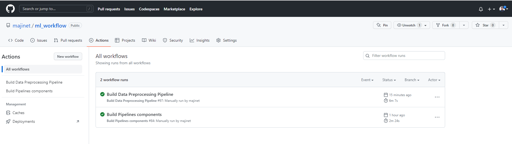
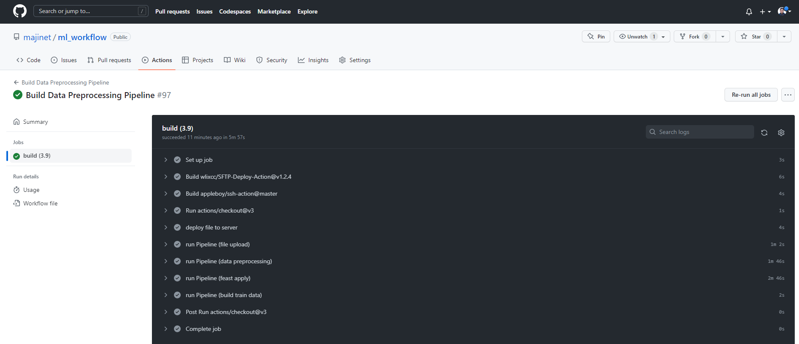
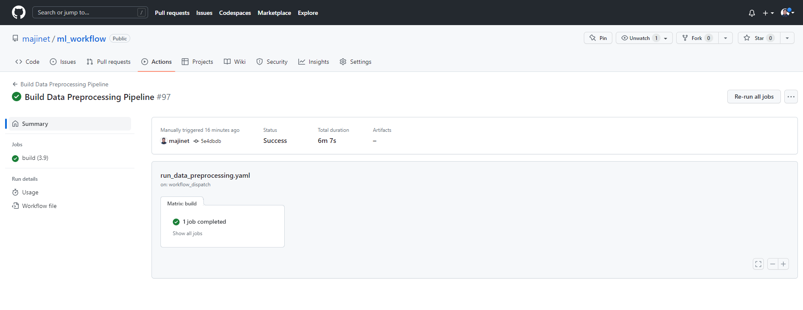

# Github Actions

GitHub Actions is a feature of the GitHub platform that provides an automated workflow for software development teams. It allows developers to define custom workflows as code and automate tasks such as building, testing, and deploying their code directly from their GitHub repositories.

GitHub Actions workflows are defined using YAML files, and can be triggered by events such as commits, pull requests, or issue comments. Workflows consist of one or more jobs, each of which consists of one or more steps. Steps can execute commands, run scripts, or interact with external services using pre-built actions.

GitHub Actions includes a marketplace of pre-built actions that can be easily integrated into workflows. These actions cover a wide range of use cases, from building and testing code to deploying applications to cloud platforms such as AWS or Azure.

GitHub Actions also includes features such as environment variables, caching, and artifacts, which allow workflows to be customized and optimized for specific use cases. Additionally, GitHub Actions integrates with GitHub's security features, allowing developers to add automated security checks to their workflows.

For example, I have built 
- one workflow for creating pipeline components in the format of Docker images for data processing.
- one workflow for running ML/AI data processing such as data cleaning, feature engineering, etc.

Each Job have several steps to execute in sequential.

After steps were processed completedly, Job will mark as completed.

