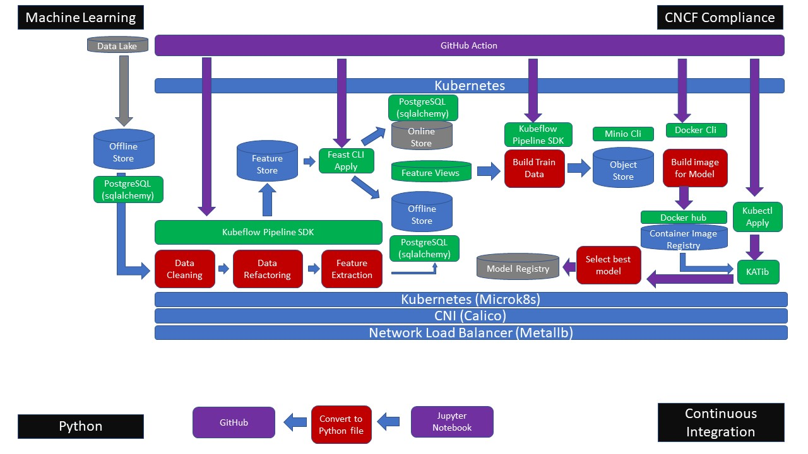

# About this project

The objective of this project is to promote a MLOps Level 2 to help companies reduce their operational costs when developing machine learning applications by standardizing and automating the ML workflow.

# Machine Learning Devops (MLOps)

Machine Learning DevOps is a set of practices and tools for deploying, testing, and managing machine learning models in production environments. It combines the principles of DevOps with machine learning workflows, and aims to increase the speed and reliability of deploying and maintaining machine learning models.

The process of Machine Learning DevOps starts with the development and training of machine learning models, followed by packaging the models into deployable artifacts, such as Docker images. The artifacts are then deployed to the target environment, such as a Kubernetes cluster or a serverless platform. Continuous integration and continuous deployment (CI/CD) pipelines are often used to automate the process of building, testing, and deploying machine learning models.

Machine Learning DevOps also involves monitoring and managing the performance of the deployed models, as well as updating and retraining the models when new data is available or when the models no longer perform adequately. This involves creating feedback loops between the deployed models and the data sources, and incorporating automated testing, monitoring, and logging into the deployment pipelines.

Overall, Machine Learning DevOps is a critical practice for organizations looking to deploy and scale machine learning models in production environments, while ensuring that the models are reliable, efficient, and continuously improving.

## MLOps Level 2

Adopting MLOps Level 2 practices provides several benefits for organizations that are developing and deploying machine learning (ML) models. Some of the key reasons to adopt MLOps Level 2 include:

Improved scalability: By standardizing the packaging and deployment of ML models, organizations can scale their ML operations more easily and reliably across different environments, such as development, testing, and production.

Increased reproducibility: By tracking the different versions of data, models, and code used in ML experiments, organizations can reproduce and compare results more easily, ensuring the validity and reliability of their ML models.

Better collaboration: By establishing clear workflows and processes for ML development and deployment, organizations can improve collaboration and communication among different teams and stakeholders, such as data scientists, developers, and operations personnel.

Enhanced quality and reliability: By implementing automated testing, monitoring, and logging practices, organizations can ensure the quality and reliability of their ML models, detecting and fixing issues more quickly and effectively.

Faster time-to-market: By automating the deployment of ML models as APIs and managing their lifecycle, organizations can reduce the time and effort required to deploy new or updated models to production.

## Continuous Integration (CI)

Continuous Integration (CI) is the practice of regularly and automatically building, testing, and integrating code changes into a shared repository. In the context of Machine Learning, CI involves automating the build, test, and deployment processes of machine learning models. This ensures that changes to a model, its features, or its infrastructure can be easily integrated and tested before being released into production.

In a typical CI process for Machine Learning, the code changes are automatically checked out from the code repository, model training is performed, and the model is tested to ensure that it meets certain performance metrics. This process can also include validation of input data and feature engineering pipelines, as well as testing the model on different hardware and software environments.

The goal of continuous integration is to catch potential errors or issues early in the development process, reducing the amount of time and resources needed to fix them. By automating this process, it also helps to increase the reliability and consistency of machine learning models.

Some common tools used in CI for Machine Learning include Jenkins, Travis CI, CircleCI, GitLab CI/CD, and GitHub Actions. These tools provide an easy and automated way to perform the build, test, and deployment steps required for Machine Learning DevOps.

### Overall Architecture

Core Components:

- Kubernetes
- Kubeflow Pipeline
- Feast (Feature Store)
- Docker & Docker Hub (Container Image Registry)
- Minio (Object Store)
- KATib (Hyperparameters Tuning)
- GitHub & GitHub Actions

### Why Cloud Native Computing Foundation (CNCF) Compliance tools are important to MLOps

Cloud Native Computing Foundation (CNCF) compliance tools provide a set of best practices and guidelines for developing, deploying, and managing cloud-native applications. Here are some reasons to adopt these tools in MLOps:

Standardization: CNCF compliance tools help standardize the way MLOps teams develop, deploy, and manage machine learning models. This can lead to more consistent and reliable workflows, making it easier to maintain and scale the models.

Portability: By following the CNCF compliance guidelines, MLOps teams can ensure that their machine learning models can run on any cloud infrastructure that supports these guidelines. This can help avoid vendor lock-in and make it easier to migrate to different cloud platforms.

Security: The CNCF compliance tools provide guidelines for secure development, deployment, and management of cloud-native applications. By following these guidelines, MLOps teams can ensure that their machine learning models are secure and protected against potential threats.

Scalability: The CNCF compliance tools provide best practices for designing scalable and resilient cloud-native applications. By following these guidelines, MLOps teams can ensure that their machine learning models can handle high volumes of data and traffic without any performance issues.

Community Support: CNCF compliance tools are developed and maintained by a large community of experts and contributors. This means that MLOps teams can benefit from a wide range of resources, including documentation, tutorials, and support from the community.

### Why use Open-source tools in MLOps

Using open-source tools in MLOps provides several advantages:

Cost-effective: Open-source tools are usually free to use and distribute, which can be particularly beneficial for smaller companies or teams with limited budgets.

Flexibility: Open-source tools are typically customizable and can be adapted to fit specific use cases or requirements.

Large community support: Open-source tools usually have a large community of developers and users, which can provide a wealth of knowledge and resources for troubleshooting and improving the tools.

Transparency: Open-source tools are open to inspection and modification by anyone, which promotes transparency and accountability.

Integration: Open-source tools can be integrated with other open-source tools, proprietary tools, or cloud services, which can help to create a more comprehensive and scalable MLOps platform.

Innovation: The open-source community is often at the forefront of innovation, which means that open-source tools are often the first to adopt new technologies or techniques.

Overall, using open-source tools in MLOps can help teams to create a more flexible, cost-effective, and innovative platform that is well-supported by a large community of developers and users.

### Why adopt Containerization infrastructure in Machine Learning System

Containerization infrastructure has several benefits when it comes to Machine Learning systems, including:

Portability: Containers provide a consistent runtime environment, making it easier to move a machine learning system from one environment to another, such as from a development environment to a production environment, or between different cloud providers.

Scalability: Containers are designed to be lightweight and easy to deploy, which makes it simple to scale up or down a machine learning system to meet changing demands.

Reproducibility: Containers can be versioned, allowing for reproducible builds and deployments. This ensures that the machine learning system behaves consistently across different environments and can be debugged more easily.

Isolation: Containers provide an isolated environment for running the machine learning system, preventing conflicts with other software running on the same machine.

Resource Efficiency: Containers allow for more efficient use of resources, such as CPU and memory, compared to running machine learning systems on virtual machines or dedicated hardware.

Overall, containerization infrastructure provides a more efficient and streamlined way to develop, test, and deploy machine learning systems, leading to faster time-to-market and increased agility.

## Continuous Deployment (CD)

### TBC
