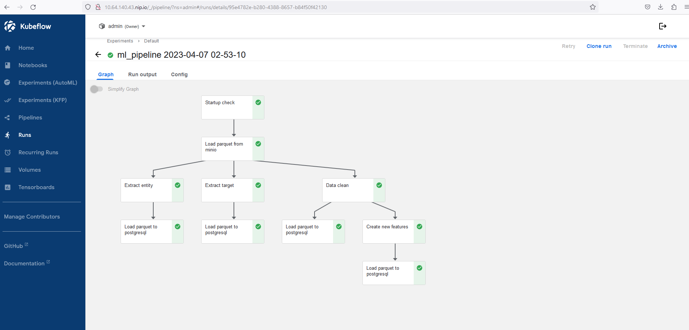

# Kubeflow Pipeline

Kubeflow Pipeline is a platform for building, deploying, and managing end-to-end machine learning workflows on Kubernetes. It provides a graphical user interface and a set of tools for defining, running, and monitoring machine learning pipelines.

A pipeline in Kubeflow is a series of interconnected steps that define the data flow and processing logic for a machine learning workflow. These steps can include data preprocessing, feature engineering, model training and evaluation, and deployment. With Kubeflow Pipeline, you can create reusable components, customize pipelines for specific use cases, and manage complex workflows with ease.

Kubeflow Pipeline provides a set of features to simplify the machine learning workflow, such as:

- A visual editor for creating and editing pipelines
- A library of reusable components for building pipelines
- Support for various machine learning frameworks, including TensorFlow, PyTorch, and Scikit-Learn
- Automatic versioning and lineage tracking of data and models
- Integration with Kubeflow's other tools and services, such as Kubeflow Serving and Kubeflow Fairing

Kubeflow Pipeline also provides a web-based user interface for monitoring the status of running pipelines, viewing logs and metrics, and debugging errors. Additionally, you can integrate Kubeflow Pipeline with your favorite version control system (e.g., Git) and Continuous Integration/Continuous Deployment (CI/CD) tools to create a streamlined end-to-end machine learning workflow.

